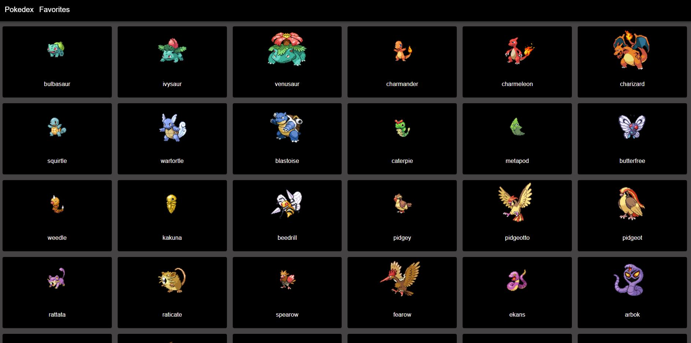

# Pokedex
  

## Description
Created with React, Redux, and Redux-persist to gather information regarding the first gen pokemon. Using Redux and Redux-persist the user can save pokemon to their favorites for easy access later. 

## Table of Contents
* [Installation](#installation)
* [Usage](#usage)
* [Contributions](#contributions)
* [Questions](#questions)

## Installation
Clone the repo then run "npm install" to download the dependencies. Then run "npm start" to have your browser open the page and start searching through pokemon. Shiny versions of each pokemon has been displayed.

## Usage
Search through the first gen pokemons and discover their types and weight along with a cool shiny photo of each one. Save them to your favorites!

## Contributions
This project was created through the help of Mohammad Kily and Udemy

## Questions
Please visit my [GitHub profile](https://github.com/blitman12) for other cool projects
If you have any remaining questions please feel free to reach me at bradlitman94@gmail.com
